# 🔍 查找算法

> 📝 **主题**: 数据结构中的查找算法原理与实现
> 🎯 **目标**: 掌握各种查找算法的原理、实现和性能分析，能够根据实际问题选择合适的查找方法

---

## 📋 章节概览

```mermaid
graph TD
    A[查找算法] --> B[基本概念]
    A --> C[静态查找]
    A --> D[动态查找]
    A --> E[哈希查找]
    
    B --> B1[查找表]
    B --> B2[关键字]
    B --> B3[查找长度]
    B --> B4[平均查找长度ASL]
    
    C --> C1[顺序查找]
    C --> C2[二分查找]
    C --> C3[分块查找]
    
    D --> D1[二叉排序树BST]
    D --> D2[平衡二叉树AVL]
    D --> D3[B树和B+树]
    
    E --> E1[哈希函数]
    E --> E2[冲突处理]
    E --> E3[性能分析]
```



---

## 💡 基本概念

### 📖 查找表 (Search Table)
**定义**: 由同一类型的数据元素（或记录）组成的集合

**核心特征**:
- **元素集合**: 包含多个数据元素
- **关键字**: 用于标识元素的数据项
- **查找操作**: 根据关键字定位元素

**查找表类型**:
- **静态查找表**: 仅进行查找操作，不改变表内容
- **动态查找表**: 查找过程中可能插入或删除元素

> ⚠️ **注意**: 查找表的操作效率直接影响整个系统的性能

> 📖 **扩展**: 查找表是数据库索引、文件系统等核心技术的基础

### 🔑 关键字 (Key)
**定义**: 数据元素中某个数据项的值，用于标识一个数据元素

**核心特征**:
- **主关键字**: 唯一标识一个元素
- **次关键字**: 可能标识多个元素
- **复合关键字**: 多个数据项组合标识

### 📏 平均查找长度 (ASL)
**定义**: 查找过程中关键字比较次数的平均值

**计算公式**:
$$ASL = \sum_{i=1}^{n} P_i \times C_i$$

其中：
- $P_i$: 查找第i个元素的概率
- $C_i$: 查找第i个元素所需的比较次数
- $n$: 查找表中元素个数

> ⚠️ **注意**: ASL是衡量查找算法效率的主要指标

---

## 🔍 静态查找表

### 🎯 顺序查找 (Sequential Search)

**定义**: 在数组头部设置监视哨，从表尾开始向前逐个比较关键字，直到找到目标或回到监视哨位置

**算法步骤**:
1. 在数组头部设置监视哨（arr[0] = key）
2. 从最后一个元素开始向前比较
3. 若相等，记录当前位置并结束查找
4. 若不等，继续向前一个元素比较
5. 直到找到或回到监视哨位置

**代码实现**:
```cpp
/**
 * 顺序查找算法（带监视哨）
 * @param arr 数组
 * @param n 数组长度
 * @param key 要查找的关键字
 * @return 找到返回索引，否则返回-1
 * 时间复杂度：O(n)
 * 空间复杂度：O(1)
 */
int sequentialSearch(int arr[], int n, int key) {
    arr[0] = key;  // 设置监视哨
    
    int i = n;
    while (arr[i] != key) {
        i--;
    }
    
    return i;  // 找到返回索引，0表示未找到
}
```

**性能分析**:

**ASL（平均查找长度）详细计算**:

假设查找每个元素的概率相等（即 $P_i = \frac{1}{n}$）：

**查找成功时**：
- 查找第1个元素需要比较1次
- 查找第2个元素需要比较2次
- ...
- 查找第n个元素需要比较n次

$$ASL_{成功} = \sum_{i=1}^{n} P_i \times C_i = \frac{1}{n} \sum_{i=1}^{n} i = \frac{1}{n} \times \frac{n(n+1)}{2} = \frac{n+1}{2}$$

**查找失败时**：
- 需要比较n+1次（遍历所有元素+监视哨）

$$ASL_{失败} = n+1$$

**总结**:
- **查找成功**: ASL = $\frac{n+1}{2}$（平均比较次数）
- **查找失败**: ASL = $n+1$（需要比较n+1次）
- **时间复杂度**: O(n)

> ⚠️ **注意**: 监视哨技术可以避免数组越界检查，提高效率

> 📖 **扩展**: 适用于无序表和小规模数据查找

### 🎯 二分查找 (Binary Search)

**定义**: 在有序表中，每次比较中间元素，根据比较结果缩小查找范围

**算法步骤**:
1. 确定查找范围[low, high]
2. 计算中间位置mid
3. 比较中间元素与关键字
4. 根据比较结果调整查找范围
5. 重复直到找到或范围为空

**代码实现**:
```cpp
/**
 * 二分查找算法（迭代版）
 * @param arr 有序数组（升序）
 * @param n 数组长度
 * @param key 要查找的关键字
 * @return 找到返回索引，否则返回-1
 * 时间复杂度：O(log n)
 * 空间复杂度：O(1)
 */
int binarySearch(int arr[], int n, int key) {
    int low = 0, high = n - 1;
    
    while (low <= high) {
        int mid = low + (high - low) / 2;  // 防止溢出
        
        if (arr[mid] == key) {
            return mid;  // 查找成功
        } else if (arr[mid] < key) {
            low = mid + 1;  // 在右半区继续查找
        } else {
            high = mid - 1;  // 在左半区继续查找
        }
    }
    
    return -1;  // 查找失败
}
```

**性能分析**:

**ASL（平均查找长度）分析**:

**查找成功时**：
二分查找的判定树是一棵完全二叉树，查找成功的平均查找长度约为：

$$ASL_{成功} = \log_2(n+1) - 1$$

**查找失败时**：
最多需要比较到树的最后一层，平均查找长度约为：

$$ASL_{失败} = \log_2(n+1)$$

**详细推导**（假设n=$2^h$-1）：
- 第1层有1个节点，需要比较1次
- 第2层有2个节点，每个需要比较2次
- 第k层有$2^{k-1}$个节点，每个需要比较k次

$$ASL_{成功} = \frac{1}{n} \sum_{k=1}^{h} k \times 2^{k-1} = \frac{n+1}{n} \log_2(n+1) - 1 \approx \log_2(n+1) - 1$$

**总结**:
- **查找成功**: ASL ≈ $\log_2(n+1) - 1$（平均比较次数）
- **查找失败**: ASL ≈ $\log_2(n+1)$（最多比较次数）
- **时间复杂度**: O(log n)

> ⚠️ **注意**: 要求查找表必须是有序的，且适合顺序存储结构

> 📖 **扩展**: 二分查找是数据库B+树索引的基础算法

### 🎯 STL中的折半查找

**C++ STL提供了多种二分查找相关的算法**：

**1. `std::binary_search` - 判断元素是否存在**
```cpp
#include <algorithm>
#include <vector>

std::vector<int> vec = {1, 3, 5, 7, 9, 11, 13};
bool exists = std::binary_search(vec.begin(), vec.end(), 7);  // 返回true
```

**2. `std::lower_bound` - 查找第一个不小于目标的位置**
```cpp
auto it = std::lower_bound(vec.begin(), vec.end(), 6);
// 返回指向元素7的迭代器
```

**3. `std::upper_bound` - 查找第一个大于目标的位置**
```cpp
auto it = std::upper_bound(vec.begin(), vec.end(), 7);
// 返回指向元素9的迭代器
```

**4. `std::equal_range` - 同时获取lower_bound和upper_bound**
```cpp
auto range = std::equal_range(vec.begin(), vec.end(), 7);
// 返回pair，包含相等的元素范围
```

**STL二分查找的特点**:
- **时间复杂度**: O(log n)
- **要求**: 容器必须是有序的
- **返回值**: 迭代器而非索引
- **适用容器**: vector、deque、数组等支持随机访问的容器

> ⚠️ **注意**: STL算法返回的是迭代器，需要通过`std::distance`获取索引位置

> 📖 **扩展**: STL算法比手动实现的二分查找更安全、更高效，建议优先使用

### 🎯 分块查找 (Block Search)

**定义**: 将查找表分成若干块，块内无序，块间有序，先确定块再在块内查找

**算法步骤**:
1. 建立索引表，记录每块的最大关键字和起始位置
2. 在索引表中查找目标块
3. 在确定的块内进行顺序查找

**代码实现**:
```cpp
/**
 * 分块查找
 * @param arr 主数据数组
 * @param index 索引数组
 * @param blocks 块数
 * @param key 要查找的关键字
 * @return 找到返回索引，否则返回-1
 * 时间复杂度：O(√n)
 * 空间复杂度：O(√n)
 */
struct IndexNode {
    int maxKey;     // 块内最大关键字
    int start;      // 块起始位置
    int length;     // 块长度
};

int blockSearch(int arr[], IndexNode index[], int blocks, int key) {
    // 第一步：在索引表中确定所在块
    int i = 0;
    while (i < blocks && key > index[i].maxKey) {
        i++;
    }
    
    if (i >= blocks) {
        return -1;  // 查找失败
    }
    
    // 第二步：在块内顺序查找
    int start = index[i].start;
    int end = start + index[i].length;
    
    for (int j = start; j < end; j++) {
        if (arr[j] == key) {
            return j;  // 查找成功
        }
    }
    
    return -1;  // 查找失败
}
```

**性能分析**:

**ASL（平均查找长度）详细分析**:

**基本参数**：将n个元素分成b块，每块有s个元素（n = b × s）

**查找过程分为两个阶段**：
1. **索引查找阶段**：在索引表中确定目标块
2. **块内查找阶段**：在确定的块内进行顺序查找

**一般情况ASL推导**：

**查找成功时**：
- 对于第i块中的元素，索引查找需要i次，块内查找平均需要(s+1)/2次
- 整体ASL：ASL<sub>成功</sub> = (b+1)/2 + (s+1)/2 = (b+s+2)/2

**查找失败时**：
- 索引查找平均需要(b+1)/2次，块内查找需要s次
- 整体ASL：ASL<sub>失败</sub> = (b+1)/2 + s

**最优块大小分析**：

对ASL = (n/s + s + 2)/2求导，令导数为0：

`d/ds[(n/s + s + 2)/2] = (1/2)(-n/s² + 1) = 0`

解得：**s = √n**，此时 **b = √n**，**ASL = √n + 1**

**总结**:
- **一般表达式**: ASL = (b+s+2)/2 = (n/s + s + 2)/2
- **最优块大小**: s = √n，此时 ASL = √n + 1
- **时间复杂度**: O(√n)
- **空间复杂度**: O(√n)（需要额外的索引表）

> ⚠️ **关键结论**: 分块查找的ASL与块大小s密切相关，当s=√n时达到最优性能

---

## 📊 查找算法性能对比

### 🎯 ASL（平均查找长度）总结

| 查找算法     | 查找成功 ASL  | 查找失败 ASL | 时间复杂度 | 适用场景           |
| :----------- | :------------ | :----------- | :--------- | :----------------- |
| **顺序查找** | (n+1)/2       | n+1          | O(n)       | 无序表，小规模数据 |
| **二分查找** | log₂(n+1) - 1 | log₂(n+1)    | O(log n)   | 有序表，顺序存储   |
| **分块查找** | (b+s+2)/2     | (b+1)/2 + s  | O(√n)      | 块间有序，块内无序 |

**分块查找最优情况**：当 s = √n 时，ASL = √n + 1

### � 具体例子对比（n = 10000）

| 查找算法     | ASL（成功）  | ASL（失败）    | 实际比较次数 |
| :----------- | :----------- | :------------- | :----------- |
| **顺序查找** | 5000.5       | 10001          | ~5000次      |
| **二分查找** | ≈13.3        | ≈14.3          | ~13次        |
| **分块查找** | 101（s=100） | 150.5（s=100） | ~100次       |

> 💡 **结论**: 分块查找在大数据量时性能明显优于顺序查找，但不如二分查找。其主要优势在于数据可以分散存储，且插入删除较灵活。

### �� 选择建议

**根据数据特性选择**:
- **数据无序**: 使用顺序查找
- **数据有序且连续存储**: 使用二分查找
- **数据部分有序**: 使用分块查找

**根据性能要求选择**:
- **性能要求高**: 二分查找（O(log n)）
- **实现简单**: 顺序查找（O(n)）
- **折中方案**: 分块查找（O($\sqrt{n}$)）

---

## 🌳 动态查找表

### 🎯 二叉排序树 (BST)

**定义**: 或者是一棵空树，或者是具有下列性质的二叉树：
1. 若左子树不空，则左子树上所有结点的值均小于它的根结点的值
2. 若右子树不空，则右子树上所有结点的值均大于它的根结点的值
3. 左、右子树也分别为二叉排序树

**结点定义**:
```cpp
/**
 * 二叉排序树结点定义
 */
struct BSTNode {
    int key;        // 关键字
    BSTNode* left;  // 左子树指针
    BSTNode* right; // 右子树指针
    
    BSTNode(int k) : key(k), left(nullptr), right(nullptr) {}
};
```

**查找算法**:
```cpp
/**
 * BST查找算法（递归版）
 * @param root 根结点指针
 * @param key 要查找的关键字
 * @return 找到返回结点指针，否则返回nullptr
 * 时间复杂度：平均O(log n)，最坏O(n)
 * 空间复杂度：平均O(log n)，最坏O(n)
 */
BSTNode* searchBST(BSTNode* root, int key) {
    if (root == nullptr || root->key == key) {
        return root;  // 查找结束
    }
    
    if (key < root->key) {
        return searchBST(root->left, key);  // 在左子树中查找
    } else {
        return searchBST(root->right, key); // 在右子树中查找
    }
}
```

**插入算法**:
```cpp
/**
 * BST插入算法
 * @param root 根结点指针的引用
 * @param key 要插入的关键字
 * 时间复杂度：平均O(log n)，最坏O(n)
 * 空间复杂度：平均O(log n)，最坏O(n)
 */
void insertBST(BSTNode*& root, int key) {
    if (root == nullptr) {
        root = new BSTNode(key);  // 创建新结点
        return;
    }
    
    if (key < root->key) {
        insertBST(root->left, key);  // 插入到左子树
    } else if (key > root->key) {
        insertBST(root->right, key); // 插入到右子树
    }
    // key == root->key 时不插入（假设无重复元素）
}
```

**删除算法**:

BST删除是BST操作中最复杂的，需要考虑三种不同情况：

**🎯 删除的三种情况**:

1. **叶子结点**（无子结点）：直接删除
2. **单子结点**：用其子结点替代被删除结点
3. **双子结点**：用前驱（左子树最大值）或后继（右子树最小值）替代，然后删除该替代结点

```cpp
/**
 * BST删除算法
 * @param root 根结点指针的引用
 * @param key 要删除的关键字
 * 核心思想：找替代 → 替换值 → 删替代
 * 时间复杂度：平均O(log n)，最坏O(n)
 * 空间复杂度：平均O(log n)，最坏O(n)
 */
void deleteBST(BSTNode*& root, int key) {
    if (root == nullptr) return;
    
    // 1. 定位要删除的结点
    if (key < root->key) {
        deleteBST(root->left, key);
    } else if (key > root->key) {
        deleteBST(root->right, key);
    } else {
        // 2. 处理删除（三种情况统一）
        BSTNode* nodeToDelete = root;
        
        // 情况1：无左子树（含叶子结点）
        if (root->left == nullptr) {
            root = root->right;
        }
        // 情况2：无右子树
        else if (root->right == nullptr) {
            root = root->left;
        }
        // 情况3：左右子树都存在
        else {
            // 找后继（右子树最小值）
            BSTNode* successor = findMin(root->right);
            root->key = successor->key;  // 替换值
            nodeToDelete = successor;    // 标记后继为待删除
            deleteBST(root->right, successor->key);  // 删后继
            return;
        }
        
        delete nodeToDelete;  // 删除目标结点
    }
}

/**
 * 查找BST中的最小值结点
 * @param root 根结点指针
 * @return 最小值结点指针
 */
BSTNode* findMin(BSTNode* root) {
    while (root->left != nullptr) {
        root = root->left;
    }
    return root;
}

/**
 * 查找BST中的最大值结点
 * @param root 根结点指针
 * @return 最大值结点指针
 */
BSTNode* findMax(BSTNode* root) {
    while (root->right != nullptr) {
        root = root->right;
    }
    return root;
}
```

### **🔍 完整实例：删除双子结点50**

**初始状态**：
```
       50
      /  \
    30    70
   /     /  \
 20    60   80
        \
         65
```

**删除过程（后继策略）**：
1. **找后继**：右子树(70→60→65)中最小值是60
2. **替换值**：50 → 60
3. **删后继**：删除原来的60结点

**结果状态**：
```
       60
      /  \
    30    70
   /     /  \
 20    65   80
```

**验证**：中序遍历 = 20→30→60→65→70→80（保持有序）

**性能分析**:
- **平均情况**: ASL = O(log n)
- **最坏情况**: ASL = O(n)（退化为链表）
- **空间复杂度**: O(n)

> ⚠️ **注意**: BST的性能高度依赖于树的形状，需要平衡机制

> 📖 **扩展**: BST是数据库索引、文件系统等的核心数据结构

### 🎯 平衡二叉树 (AVL树)

**定义**: 一棵空树或它的左右两个子树的高度差的绝对值不超过1，并且左右两个子树都是一棵平衡二叉树

**平衡因子**: 某结点的左子树与右子树的高度差
- **平衡**: 平衡因子为-1, 0, 1
- **不平衡**: 平衡因子为±2

**结点定义**:
```cpp
/**
 * AVL树结点定义
 */
struct AVLNode {
    int key;        // 关键字
    int height;     // 结点高度
    AVLNode* left;  // 左子树指针
    AVLNode* right; // 右子树指针
    
    AVLNode(int k) : key(k), height(1), left(nullptr), right(nullptr) {}
};
```

**获取高度和平衡因子**:
```cpp
/**
 * 获取结点高度
 */
int getHeight(AVLNode* node) {
    return node ? node->height : 0;
}

/**
 * 获取平衡因子
 */
int getBalanceFactor(AVLNode* node) {
    return node ? getHeight(node->left) - getHeight(node->right) : 0;
}

/**
 * 更新结点高度
 */
void updateHeight(AVLNode* node) {
    if (node) {
        node->height = max(getHeight(node->left), getHeight(node->right)) + 1;
    }
}
```

**旋转操作**:

### **🔍 AVL旋转的四种情况详解**

AVL树在插入或删除后可能失去平衡，需要通过旋转来恢复平衡。旋转分为四种情况，根据插入位置的不同而选择不同的旋转策略：

| 情况   | 平衡因子 | 插入位置     | 旋转策略 | 说明                         |
| :----- | :------- | :----------- | :------- | :--------------------------- |
| **LL** | > 1      | 左子树的左侧 | 右旋     | 最简单的情况，直接右旋       |
| **RR** | < -1     | 右子树的右侧 | 左旋     | 最简单的情况，直接左旋       |
| **LR** | > 1      | 左子树的右侧 | 左右旋   | 先左旋左子树，再右旋当前结点 |
| **RL** | < -1     | 右子树的左侧 | 右左旋   | 先右旋右子树，再左旋当前结点 |

**记忆技巧**：
- 平衡因子符号指示哪边重（正数左边重，负数右边重）
- 插入位置与重的一边同向用单旋，反向用双旋
- **同向单旋，反向双旋**

```cpp
/**
 * 右旋操作
 *       y                       x
 *      / \                     / \
 *     x   T3    右旋(y)        T1  y
 *    / \    ------------->       / \
 *   T1  T2                      T2  T3
 */
AVLNode* rightRotate(AVLNode* y) {
    AVLNode* x = y->left;
    AVLNode* T2 = x->right;
    
    // 执行旋转
    x->right = y;
    y->left = T2;
    
    // 更新高度
    updateHeight(y);
    updateHeight(x);
    
    return x;  // 返回新的根结点
}

/**
 * 左旋操作
 *     x                           y
 *    / \                         / \
 *   T1  y      左旋(x)          x   T3
 *      / \  ------------->    / \
 *     T2  T3                  T1  T2
 */
AVLNode* leftRotate(AVLNode* x) {
    AVLNode* y = x->right;
    AVLNode* T2 = y->left;
    
    // 执行旋转
    y->left = x;
    x->right = T2;
    
    // 更新高度
    updateHeight(x);
    updateHeight(y);
    
    return y;  // 返回新的根结点
}
```

### **📝 旋转操作实例**

**LL情况示例**：在左子树的左侧插入导致不平衡

```
    30(2)          30(2)         20(0)
   /             /             /  \
 20(1)  →     20(2)   →     10    30
 /             /
10(0)        10(0)
不平衡!       需要右旋
```

**LR情况示例**：在左子树的右侧插入导致不平衡

```
    30(2)          30(2)         25(0)
   /             /             /  \
 20(-1)  →     20(1)   →     20    30
   \           /
   25(0)     25(0)
不平衡!     先左旋20，再右旋30
```

### **💡 调试技巧**

1. **打印平衡因子**：在每次插入后打印每个结点的平衡因子
2. **验证旋转**：确认旋转后树的高度差恢复到-1,0,1
3. **中序验证**：旋转后进行中序遍历，确保序列仍然有序
4. **边界测试**：测试连续插入递增/递减序列的情况

**插入算法**:
```cpp
/**
 * AVL插入算法
 * @param root 根结点指针
 * @param key 要插入的关键字
 * @return 新的根结点指针
 * 时间复杂度：O(log n)
 * 空间复杂度：O(log n)
 */
AVLNode* insertAVL(AVLNode* root, int key) {
    // 1. 执行正常的BST插入
    if (root == nullptr) {
        return new AVLNode(key);
    }
    
    if (key < root->key) {
        root->left = insertAVL(root->left, key);
    } else if (key > root->key) {
        root->right = insertAVL(root->right, key);
    } else {
        return root;  // 重复关键字不插入
    }
    
    // 2. 更新当前结点高度
    updateHeight(root);
    
    // 3. 获取平衡因子并检查平衡
    int balance = getBalanceFactor(root);
    
    // 4. 执行旋转操作恢复平衡
    
    // 🔍 左左情况（LL）：左子树的左子树插入
    // 平衡因子 > 1 且插入在左子树的左侧
    // 解决方案：对当前结点执行右旋
    if (balance > 1 && key < root->left->key) {
        return rightRotate(root);
    }
    
    // 🔍 右右情况（RR）：右子树的右子树插入  
    // 平衡因子 < -1 且插入在右子树的右侧
    // 解决方案：对当前结点执行左旋
    if (balance < -1 && key > root->right->key) {
        return leftRotate(root);
    }
    
    // 🔍 左右情况（LR）：左子树的右子树插入
    // 平衡因子 > 1 但插入在左子树的右侧
    // 解决方案：先对左子树左旋，再对当前结点右旋
    if (balance > 1 && key > root->left->key) {
        root->left = leftRotate(root->left);  // 左子树左旋
        return rightRotate(root);               // 当前结点右旋
    }
    
    // 🔍 右左情况（RL）：右子树的左子树插入
    // 平衡因子 < -1 但插入在右子树的左侧  
    // 解决方案：先对右子树右旋，再对当前结点左旋
    if (balance < -1 && key < root->right->key) {
        root->right = rightRotate(root->right); // 右子树右旋
        return leftRotate(root);                // 当前结点左旋
    }
    
    return root;  // 返回未改变的根结点指针
}
```

**性能分析**:
- **查找成功**: ASL = O(log n)
- **查找失败**: ASL = O(log n)
- **时间复杂度**: O(log n)
- **空间复杂度**: O(n)

> ⚠️ **注意**: AVL树始终保持严格平衡，查找效率稳定

> 📖 **扩展**: AVL树适用于查找操作频繁、插入删除较少的场景

### 🎯 B-树和B+树 (B-Tree and B+ Tree)

**定义**: B-树是一种平衡的多路查找树，每个结点可以拥有多于两个子结点，适用于磁盘等外部存储设备

**核心特性**:
- **多路平衡**: 每个结点可以有多个子结点，降低树的高度
- **阶数**: B-树的阶数m表示每个结点最多有m个子结点
- **关键字范围**: 每个结点包含的关键字数在⌈m/2⌉-1到m-1之间
- **所有叶子在同一层**: 保证查找路径长度一致

**B树结点定义**:
```cpp
/**
 * B-树结点定义
 * @param m B树的阶数
 */
struct BTreeNode {
    int keyCount;           // 关键字个数
    int* keys;              // 关键字数组
    BTreeNode** children;   // 子结点指针数组
    BTreeNode* parent;      // 父结点指针
    bool isLeaf;            // 是否为叶子结点
    
    BTreeNode(int m, bool leaf = true) : keyCount(0), isLeaf(leaf) {
        keys = new int[m - 1];
        children = new BTreeNode*[m];
        parent = nullptr;
        for (int i = 0; i < m; i++) {
            children[i] = nullptr;
        }
    }
};
```

**B-树性质**:
1. **根结点**: 至少有2个子结点（除非根是叶子结点）
2. **内部结点**: 至少有⌈m/2⌉个子结点，最多有m个子结点
3. **关键字数量**: 每个结点包含n个关键字和n+1个子结点
4. **有序性**: 关键字在结点内按升序排列
5. **平衡性**: 所有叶子结点都在同一层

**B+树特性**:
- **数据存储**: 所有数据都存储在叶子结点中
- **叶子链表**: 叶子结点通过指针连接，便于范围查询
- **内部结点**: 只存储索引关键字，不存储数据
- **查找稳定性**: 所有查找都必须到达叶子结点

#### 🔍 B-树查找操作

**查找算法**:
```cpp
/**
 * B树查找算法
 * @param root 根结点指针
 * @param key 要查找的关键字
 * @return 找到返回true，否则返回false
 * 时间复杂度：O(log_m n)
 * 空间复杂度：O(1)
 */
bool searchBTree(BTreeNode* root, int key) {
    if (root == nullptr) return false;
    
    int i = 0;
    // 在当前结点中查找关键字
    while (i < root->keyCount && key > root->keys[i]) {
        i++;
    }
    
    // 找到关键字
    if (i < root->keyCount && key == root->keys[i]) {
        return true;
    }
    
    // 如果是叶子结点，说明未找到
    if (root->isLeaf) {
        return false;
    }
    
    // 在相应的子树中递归查找
    return searchBTree(root->children[i], key);
}
```

#### 📝 B-树插入操作

**插入策略**:
1. **查找插入位置**: 找到合适的叶子结点
2. **直接插入**: 如果叶子结点未满，直接插入
3. **结点分裂**: 如果叶子结点已满，进行分裂操作

**插入算法**:
```cpp
/**
 * B-树插入算法
 * @param root 根结点指针的引用
 * @param key 要插入的关键字
 * @param m B树的阶数
 */
void insertBTree(BTreeNode*& root, int key, int m) {
    // 如果根结点为空，创建新根
    if (root == nullptr) {
        root = new BTreeNode(m, true);
        root->keys[0] = key;
        root->keyCount = 1;
        return;
    }
    
    // 如果根结点已满，需要分裂
    if (root->keyCount == m - 1) {
        BTreeNode* newRoot = new BTreeNode(m, false);
        newRoot->children[0] = root;
        root->parent = newRoot;
        
        // 分裂根结点
        splitChild(newRoot, 0, root, m);
        
        // 确定新关键字应该插入哪个子树
        int i = 0;
        if (newRoot->keys[0] < key) i++;
        insertNonFull(newRoot->children[i], key, m);
        
        root = newRoot;
    } else {
        // 根结点未满，直接插入
        insertNonFull(root, key, m);
    }
}

/**
 * 向非满结点插入关键字
 */
void insertNonFull(BTreeNode* node, int key, int m) {
    int i = node->keyCount - 1;
    
    if (node->isLeaf) {
        // 叶子结点：直接插入关键字
        while (i >= 0 && node->keys[i] > key) {
            node->keys[i + 1] = node->keys[i];
            i--;
        }
        node->keys[i + 1] = key;
        node->keyCount++;
    } else {
        // 内部结点：找到合适的子结点
        while (i >= 0 && node->keys[i] > key) {
            i--;
        }
        i++;
        
        // 如果子结点已满，先分裂
        if (node->children[i]->keyCount == m - 1) {
            splitChild(node, i, node->children[i], m);
            
            if (node->keys[i] < key) i++;
        }
        
        insertNonFull(node->children[i], key, m);
    }
}

/**
 * 分裂子结点
 */
void splitChild(BTreeNode* parent, int index, BTreeNode* fullNode, int m) {
    // 创建新结点，存储fullNode的后半部分
    BTreeNode* newNode = new BTreeNode(m, fullNode->isLeaf);
    newNode->keyCount = m / 2 - 1;
    
    // 复制关键字到新结点
    for (int i = 0; i < m / 2 - 1; i++) {
        newNode->keys[i] = fullNode->keys[i + m / 2];
    }
    
    // 如果是内部结点，复制子结点指针
    if (!fullNode->isLeaf) {
        for (int i = 0; i < m / 2; i++) {
            newNode->children[i] = fullNode->children[i + m / 2];
            if (newNode->children[i]) {
                newNode->children[i]->parent = newNode;
            }
        }
    }
    
    // 调整fullNode的关键字数量
    fullNode->keyCount = m / 2 - 1;
    
    // 在父结点中为新结点腾出位置
    for (int i = parent->keyCount; i >= index + 1; i--) {
        parent->children[i + 1] = parent->children[i];
    }
    parent->children[index + 1] = newNode;
    newNode->parent = parent;
    
    // 在父结点中移动中间关键字
    for (int i = parent->keyCount - 1; i >= index; i--) {
        parent->keys[i + 1] = parent->keys[i];
    }
    parent->keys[index] = fullNode->keys[m / 2 - 1];
    parent->keyCount++;
}
```

#### 🗑️ B-树删除操作

**删除策略**:
1. **查找删除结点**: 找到包含目标关键字的结点
2. **直接删除**: 如果关键字在叶子结点且删除后不破坏B树性质
3. **借位或合并**: 如果删除会导致结点关键字数过少，需要借位或合并

**删除算法**:
```cpp
/**
 * B-树删除算法
 * @param root 根结点指针的引用
 * @param key 要删除的关键字
 * @param m B树的阶数
 */
void deleteBTree(BTreeNode*& root, int key, int m) {
    if (root == nullptr) return;
    
    deleteFromNode(root, key, m);
    
    // 如果根结点关键字数为0，调整根结点
    if (root->keyCount == 0) {
        BTreeNode* oldRoot = root;
        if (root->isLeaf) {
            root = nullptr;
        } else {
            root = root->children[0];
            if (root) root->parent = nullptr;
        }
        delete oldRoot;
    }
}

/**
 * 从结点中删除关键字
 */
void deleteFromNode(BTreeNode* node, int key, int m) {
    int i = 0;
    while (i < node->keyCount && node->keys[i] < key) {
        i++;
    }
    
    if (i < node->keyCount && node->keys[i] == key) {
        // 找到关键字
        if (node->isLeaf) {
            // 情况1：关键字在叶子结点中
            removeFromLeaf(node, i);
        } else {
            // 情况2：关键字在内部结点中
            removeFromInternal(node, i, m);
        }
    } else {
        // 关键字不在当前结点中
        if (node->isLeaf) {
            return; // 关键字不存在
        }
        
        bool flag = (i == node->keyCount);
        
        // 确保子结点有足够的关键字
        if (node->children[i]->keyCount < (m + 1) / 2) {
            fillChild(node, i, m);
        }
        
        if (flag && i > node->keyCount) {
            deleteFromNode(node->children[i - 1], key, m);
        } else {
            deleteFromNode(node->children[i], key, m);
        }
    }
}

/**
 * 从叶子结点删除关键字
 */
void removeFromLeaf(BTreeNode* node, int index) {
    for (int i = index + 1; i < node->keyCount; i++) {
        node->keys[i - 1] = node->keys[i];
    }
    node->keyCount--;
}

/**
 * 从内部结点删除关键字
 */
void removeFromInternal(BTreeNode* node, int index, int m) {
    int key = node->keys[index];
    
    // 情况2a：前驱子结点有足够关键字
    if (node->children[index]->keyCount >= (m + 1) / 2) {
        int pred = getPredecessor(node, index);
        node->keys[index] = pred;
        deleteFromNode(node->children[index], pred, m);
    }
    // 情况2b：后继子结点有足够关键字
    else if (node->children[index + 1]->keyCount >= (m + 1) / 2) {
        int succ = getSuccessor(node, index);
        node->keys[index] = succ;
        deleteFromNode(node->children[index + 1], succ, m);
    }
    // 情况2c：前后子结点关键字都不足
    else {
        mergeChildren(node, index, m);
        deleteFromNode(node->children[index], key, m);
    }
}

/**
 * 获取前驱关键字
 */
int getPredecessor(BTreeNode* node, int index) {
    BTreeNode* current = node->children[index];
    while (!current->isLeaf) {
        current = current->children[current->keyCount];
    }
    return current->keys[current->keyCount - 1];
}

/**
 * 获取后继关键字
 */
int getSuccessor(BTreeNode* node, int index) {
    BTreeNode* current = node->children[index + 1];
    while (!current->isLeaf) {
        current = current->children[0];
    }
    return current->keys[0];
}

/**
 * 合并子结点
 */
void mergeChildren(BTreeNode* parent, int index, int m) {
    BTreeNode* child1 = parent->children[index];
    BTreeNode* child2 = parent->children[index + 1];
    
    // 将父结点的关键字下移到child1
    child1->keys[child1->keyCount] = parent->keys[index];
    
    // 复制child2的关键字到child1
    for (int i = 0; i < child2->keyCount; i++) {
        child1->keys[child1->keyCount + 1 + i] = child2->keys[i];
    }
    
    // 如果不是叶子结点，复制子结点指针
    if (!child1->isLeaf) {
        for (int i = 0; i <= child2->keyCount; i++) {
            child1->children[child1->keyCount + 1 + i] = child2->children[i];
            if (child1->children[child1->keyCount + 1 + i]) {
                child1->children[child1->keyCount + 1 + i]->parent = child1;
            }
        }
    }
    
    child1->keyCount += child2->keyCount + 1;
    
    // 从父结点中删除关键字和子结点指针
    for (int i = index + 1; i < parent->keyCount; i++) {
        parent->keys[i - 1] = parent->keys[i];
    }
    for (int i = index + 2; i <= parent->keyCount; i++) {
        parent->children[i - 1] = parent->children[i];
    }
    parent->keyCount--;
    
    delete child2;
}
```

#### 📊 B-树性能分析

**时间复杂度**:
- **查找**: O(log_m n) - 树的高度为 O(log_m n)
- **插入**: O(log_m n) - 需要分裂操作时可能向上传播
- **删除**: O(log_m n) - 可能需要借位或合并操作

**空间复杂度**:
- **空间**: O(n) - 存储所有关键字和指针
- **阶数影响**: 阶数m越大，树的高度越低，但需要更多内存存储结点

**优势**:
- **磁盘友好**: 减少磁盘I/O次数，一个结点通常对应一个磁盘块
- **高度平衡**: 所有叶子在同一层，查找路径长度一致
- **范围查询**: B+树的叶子链表便于范围查询

**应用场景**:
- **数据库索引**: MySQL、PostgreSQL等数据库的索引实现
- **文件系统**: NTFS、ext4等文件系统的目录结构
- **存储系统**: 需要大量数据存储和快速查找的场景

> ⚠️ **注意**: B-树的阶数m需要根据磁盘块大小和关键字大小合理选择

> 📖 **扩展**: B+树是B-树的变种，所有数据都存储在叶子结点，内部结点只存储索引，更适合范围查询

---

## 🔐 哈希查找

### 💡 哈希表基本概念

**定义**: 根据设定的哈希函数和处理冲突的方法，将关键字映射到有限的地址范围内

**核心组成**:
- **哈希函数**: $H(key) \rightarrow address$
- **冲突处理**: 解决不同关键字映射到同一地址的问题
- **装载因子**: $\alpha = \frac{填入表中的记录个数}{哈希表的长度}$

### 🎯 哈希函数构造方法

**核心原则**: 计算简单、分布均匀、冲突最少

**1. 除留余数法**（最常用）:
$$H(key) = key \mod p$$
其中p为不大于哈希表长度的最大素数

```cpp
int hashFunction(int key, int tableSize) {
    return key % tableSize;  // tableSize取素数
}
```

**2. 其他方法**:
- **平方取中法**: 取关键字平方的中间几位
- **折叠法**: 将关键字分割后叠加
- **乘法哈希**: 使用黄金比例常数

```cpp
/**
 * 乘法哈希函数
 * 使用黄金比例常数
 */
int hashFunction4(int key, int tableSize) {
    const double A = 0.6180339887;  // 黄金比例减1
    double frac = key * A - floor(key * A);  // 取小数部分
    return (int)(tableSize * frac);
}
```

**5. 字符串哈希函数**:
对于字符串关键字，常用的哈希方法

```cpp
/**
 * 多项式滚动哈希函数
 * 适用于字符串关键字
 */
unsigned long hashString(const string& str, int tableSize) {
    const int prime = 31;  // 小素数
    unsigned long hash = 0;
    unsigned long power = 1;
    
    for (char c : str) {
        hash = (hash + (c - 'a' + 1) * power) % tableSize;
        power = (power * prime) % tableSize;
    }
    
    return hash;
}
```

### 🎯 冲突处理方法

**1. 链地址法 (Separate Chaining)**:
将所有哈希地址相同的记录存储在同一个链表中

```cpp
/**
 * 链地址法哈希表实现
 * 每个桶使用链表存储冲突元素
 */
class ChainingHashTable {
private:
    static const int TABLE_SIZE = 101;  // 素数大小
    
    struct Node {
        int key;
        int value;
        Node* next;
        Node(int k, int v) : key(k), value(v), next(nullptr) {}
    };
    
    Node** table;  // 指针数组
    
    int hashFunction(int key) {
        return key % TABLE_SIZE;
    }
    
public:
    ChainingHashTable() {
        table = new Node*[TABLE_SIZE];
        for (int i = 0; i < TABLE_SIZE; i++) {
            table[i] = nullptr;
        }
    }
    
    void insert(int key, int value) {
        int hash = hashFunction(key);
        Node* newNode = new Node(key, value);
        
        // 插入到链表头部
        newNode->next = table[hash];
        table[hash] = newNode;
    }
    
    int search(int key) {
        int hash = hashFunction(key);
        Node* current = table[hash];
        
        while (current) {
            if (current->key == key) {
                return current->value;
            }
            current = current->next;
        }
        return -1;  // 未找到
    }
    
    bool remove(int key) {
        int hash = hashFunction(key);
        Node* current = table[hash];
        Node* prev = nullptr;
        
        while (current) {
            if (current->key == key) {
                if (prev) prev->next = current->next;
                else table[hash] = current->next;
                delete current;
                return true;
            }
            prev = current;
            current = current->next;
        }
        return false;
    }
    
    ~ChainingHashTable() {
        for (int i = 0; i < TABLE_SIZE; i++) {
            Node* current = table[i];
            while (current) {
                Node* temp = current;
                current = current->next;
                delete temp;
            }
        }
        delete[] table;
    }
};
```

**2. 开放定址法 (Open Addressing)**:
$$H_i = (H(key) + d_i) \mod m$$

**线性探测**: $d_i = i$ （简单但可能聚集）
**二次探测**: $d_i = i^2$ （减少聚集）
**双重哈希**: $d_i = i \times H_2(key)$ （效果最佳）

#### 💻 开放地址法实现示例

**1. 线性探测哈希表实现**:

```cpp
/**
 * 线性探测哈希表
 * 冲突时按顺序查找下一个空位置
 * 优点：实现简单；缺点：容易产生聚集现象
 */
class LinearProbingHashTable {
private:
    static const int EMPTY = -1;      // 空位置标记
    static const int DELETED = -2;    // 删除位置标记
    static const int TABLE_SIZE = 101; // 建议使用质数
    
    int* keys;
    int* values;
    int size;  // 当前元素个数
    
    int hashFunction(int key) {
        return key % TABLE_SIZE;  // 除留余数法
    }
    
public:
    LinearProbingHashTable() {
        keys = new int[TABLE_SIZE];
        values = new int[TABLE_SIZE];
        size = 0;
        
        // 初始化所有位置为空
        for (int i = 0; i < TABLE_SIZE; i++) {
            keys[i] = EMPTY;
        }
    }
    
    /**
     * 插入键值对
     * 如果键已存在则更新值
     * 时间复杂度：平均O(1)，最坏O(n)
     */
    void insert(int key, int value) {
        if (size >= TABLE_SIZE * 0.7) {  // 装载因子超过0.7时扩容
            resize();
        }
        
        int hash = hashFunction(key);
        int originalHash = hash;
        int deletedPos = -1;  // 记录第一个删除位置
        
        // 线性探测
        while (keys[hash] != EMPTY) {
            if (keys[hash] == key) {  // 键已存在，更新值
                values[hash] = value;
                return;
            }
            
            if (keys[hash] == DELETED && deletedPos == -1) {
                deletedPos = hash;  // 记录第一个删除位置
            }
            
            hash = (hash + 1) % TABLE_SIZE;
            if (hash == originalHash) {
                throw overflow_error("哈希表已满");
            }
        }
        
        // 使用删除位置或空位置
        int insertPos = (deletedPos != -1) ? deletedPos : hash;
        keys[insertPos] = key;
        values[insertPos] = value;
        size++;
    }
    
    /**
     * 查找键对应的值
     * 时间复杂度：平均O(1)，最坏O(n)
     */
    int search(int key) {
        int hash = hashFunction(key);
        int originalHash = hash;
        
        while (keys[hash] != EMPTY) {
            if (keys[hash] == key) {
                return values[hash];
            }
            hash = (hash + 1) % TABLE_SIZE;
            if (hash == originalHash) break;  // 避免无限循环
        }
        
        return -1;  // 未找到
    }
    
    /**
     * 删除键值对
     * 使用懒惰删除策略，标记为DELETED而非真正删除
     * 时间复杂度：平均O(1)，最坏O(n)
     */
    void remove(int key) {
        int hash = hashFunction(key);
        int originalHash = hash;
        
        while (keys[hash] != EMPTY) {
            if (keys[hash] == key) {
                keys[hash] = DELETED;
                size--;
                return;
            }
            hash = (hash + 1) % TABLE_SIZE;
            if (hash == originalHash) break;
        }
    }
    
    /**
     * 扩容操作
     * 创建更大的哈希表并重新插入所有元素
     */
    void resize() {
        int oldSize = TABLE_SIZE;
        int* oldKeys = keys;
        int* oldValues = values;
        
        keys = new int[TABLE_SIZE * 2];
        values = new int[TABLE_SIZE * 2];
        size = 0;
        
        for (int i = 0; i < TABLE_SIZE * 2; i++) {
            keys[i] = EMPTY;
        }
        
        // 重新插入所有元素
        for (int i = 0; i < oldSize; i++) {
            if (oldKeys[i] != EMPTY && oldKeys[i] != DELETED) {
                insert(oldKeys[i], oldValues[i]);
            }
        }
        
        delete[] oldKeys;
        delete[] oldValues;
    }
    
    /**
     * 调试辅助：显示哈希表状态
     */
    void display() {
        cout << "哈希表状态:" << endl;
        for (int i = 0; i < TABLE_SIZE; i++) {
            if (keys[i] == EMPTY) {
                cout << "[" << i << "]: EMPTY" << endl;
            } else if (keys[i] == DELETED) {
                cout << "[" << i << "]: DELETED" << endl;
            } else {
                cout << "[" << i << "]: (" << keys[i] << ", " << values[i] << ")" << endl;
            }
        }
    }
    
    ~LinearProbingHashTable() {
        delete[] keys;
        delete[] values;
    }
};
```

**2. 二次探测哈希表实现**:

```cpp
/**
 * 二次探测哈希表
 * 冲突时按照平方增量查找，减少聚集现象
 * 优点：减少聚集；缺点：可能探测不到所有位置
 */
class QuadraticProbingHashTable {
private:
    static const int EMPTY = -1;
    static const int DELETED = -2;
    static const int TABLE_SIZE = 101;  // 建议使用4k+3形式的质数
    
    int* keys;
    int* values;
    int size;
    
    int hashFunction(int key) {
        return key % TABLE_SIZE;
    }
    
public:
    QuadraticProbingHashTable() {
        keys = new int[TABLE_SIZE];
        values = new int[TABLE_SIZE];
        size = 0;
        
        for (int i = 0; i < TABLE_SIZE; i++) {
            keys[i] = EMPTY;
        }
    }
    
    /**
     * 插入键值对
     * 使用二次探测解决冲突
     */
    void insert(int key, int value) {
        if (size >= TABLE_SIZE * 0.5) {  // 二次探测建议较低的装载因子
            resize();
        }
        
        int hash = hashFunction(key);
        int i = 1;
        int deletedPos = -1;
        
        // 二次探测：±1², ±2², ±3², ...
        while (keys[hash] != EMPTY) {
            if (keys[hash] == key) {
                values[hash] = value;
                return;
            }
            
            if (keys[hash] == DELETED && deletedPos == -1) {
                deletedPos = hash;
            }
            
            // 二次探测公式：h(k) + i²
            hash = (hashFunction(key) + i * i) % TABLE_SIZE;
            i++;
            if (i > TABLE_SIZE / 2) {  // 二次探测可能无法找到空位置
                if (deletedPos != -1) {
                    hash = deletedPos;
                    break;
                } else {
                    throw overflow_error("哈希表已满或无法找到空位置");
                }
            }
        }
        
        int insertPos = (deletedPos != -1) ? deletedPos : hash;
        keys[insertPos] = key;
        values[insertPos] = value;
        size++;
    }
    
    /**
     * 查找键对应的值
     */
    int search(int key) {
        int hash = hashFunction(key);
        int i = 1;
        
        while (keys[hash] != EMPTY && i <= TABLE_SIZE / 2) {
            if (keys[hash] == key) {
                return values[hash];
            }
            hash = (hashFunction(key) + i * i) % TABLE_SIZE;
            i++;
        }
        
        return -1;
    }
    
    /**
     * 删除键值对
     */
    void remove(int key) {
        int hash = hashFunction(key);
        int i = 1;
        
        while (keys[hash] != EMPTY && i <= TABLE_SIZE / 2) {
            if (keys[hash] == key) {
                keys[hash] = DELETED;
                size--;
                return;
            }
            hash = (hashFunction(key) + i * i) % TABLE_SIZE;
            i++;
        }
    }
    
    /**
     * 扩容操作
     */
    void resize() {
        int oldSize = TABLE_SIZE;
        int* oldKeys = keys;
        int* oldValues = values;
        
        keys = new int[TABLE_SIZE * 2];
        values = new int[TABLE_SIZE * 2];
        size = 0;
        
        for (int i = 0; i < TABLE_SIZE * 2; i++) {
            keys[i] = EMPTY;
        }
        
        // 重新插入所有元素
        for (int i = 0; i < oldSize; i++) {
            if (oldKeys[i] != EMPTY && oldKeys[i] != DELETED) {
                insert(oldKeys[i], oldValues[i]);
            }
        }
        
        delete[] oldKeys;
        delete[] oldValues;
    }
    
    ~QuadraticProbingHashTable() {
        delete[] keys;
        delete[] values;
    }
};
```

**3. 双重哈希实现**:

```cpp
/**
 * 双重哈希哈希表
 * 使用两个不同的哈希函数，冲突时按第二个哈希函数的步长探测
 * 优点：分布最均匀，聚集最少；缺点：计算开销稍大
 */
class DoubleHashingHashTable {
private:
    static const int EMPTY = -1;
    static const int DELETED = -2;
    static const int TABLE_SIZE = 101;  // 建议使用质数
    
    int* keys;
    int* values;
    int size;
    
    /**
     * 第一个哈希函数：主哈希函数
     */
    int hashFunction1(int key) {
        return key % TABLE_SIZE;
    }
    
    /**
     * 第二个哈希函数：步长函数
     * 必须确保步长不为0且与表大小互质
     */
    int hashFunction2(int key) {
        return 1 + (key % (TABLE_SIZE - 1));  // 步长范围[1, TABLE_SIZE-1]
    }
    
public:
    DoubleHashingHashTable() {
        keys = new int[TABLE_SIZE];
        values = new int[TABLE_SIZE];
        size = 0;
        
        for (int i = 0; i < TABLE_SIZE; i++) {
            keys[i] = EMPTY;
        }
    }
    
    /**
     * 插入键值对
     * 使用双重哈希解决冲突
     */
    void insert(int key, int value) {
        if (size >= TABLE_SIZE * 0.7) {  // 建议装载因子不超过0.7
            resize();
        }
        
        int hash1 = hashFunction1(key);
        int hash2 = hashFunction2(key);
        int i = 0;
        int deletedPos = -1;
        
        // 双重哈希探测：h₁(k) + i × h₂(k)
        while (keys[hash1] != EMPTY) {
            if (keys[hash1] == key) {
                values[hash1] = value;
                return;
            }
            
            if (keys[hash1] == DELETED && deletedPos == -1) {
                deletedPos = hash1;
            }
            
            i++;
            hash1 = (hashFunction1(key) + i * hash2) % TABLE_SIZE;
            if (i >= TABLE_SIZE) {
                if (deletedPos != -1) {
                    hash1 = deletedPos;
                    break;
                } else {
                    throw overflow_error("哈希表已满");
                }
            }
        }
        
        int insertPos = (deletedPos != -1) ? deletedPos : hash1;
        keys[insertPos] = key;
        values[insertPos] = value;
        size++;
    }
    
    /**
     * 查找键对应的值
     */
    int search(int key) {
        int hash1 = hashFunction1(key);
        int hash2 = hashFunction2(key);
        int i = 0;
        
        while (keys[hash1] != EMPTY && i < TABLE_SIZE) {
            if (keys[hash1] == key) {
                return values[hash1];
            }
            i++;
            hash1 = (hashFunction1(key) + i * hash2) % TABLE_SIZE;
        }
        
        return -1;
    }
    
    /**
     * 删除键值对
     */
    void remove(int key) {
        int hash1 = hashFunction1(key);
        int hash2 = hashFunction2(key);
        int i = 0;
        
        while (keys[hash1] != EMPTY && i < TABLE_SIZE) {
            if (keys[hash1] == key) {
                keys[hash1] = DELETED;
                size--;
                return;
            }
            i++;
            hash1 = (hashFunction1(key) + i * hash2) % TABLE_SIZE;
        }
    }
    
    /**
     * 扩容操作
     */
    void resize() {
        int oldSize = TABLE_SIZE;
        int* oldKeys = keys;
        int* oldValues = values;
        
        keys = new int[TABLE_SIZE * 2];
        values = new int[TABLE_SIZE * 2];
        size = 0;
        
        for (int i = 0; i < TABLE_SIZE * 2; i++) {
            keys[i] = EMPTY;
        }
        
        // 重新插入所有元素
        for (int i = 0; i < oldSize; i++) {
            if (oldKeys[i] != EMPTY && oldKeys[i] != DELETED) {
                insert(oldKeys[i], oldValues[i]);
            }
        }
        
        delete[] oldKeys;
        delete[] oldValues;
    }
    
    /**
     * 调试辅助：分析哈希表性能
     */
    void analyzePerformance() {
        int totalProbes = 0;
        int maxProbes = 0;
        int elementCount = 0;
        
        for (int i = 0; i < TABLE_SIZE; i++) {
            if (keys[i] != EMPTY && keys[i] != DELETED) {
                int key = keys[i];
                int hash1 = hashFunction1(key);
                int hash2 = hashFunction2(key);
                int probes = 0;
                int j = 0;
                
                while (j < TABLE_SIZE) {
                    probes++;
                    if (keys[hash1] == key) break;
                    j++;
                    hash1 = (hashFunction1(key) + j * hash2) % TABLE_SIZE;
                }
                
                totalProbes += probes;
                maxProbes = max(maxProbes, probes);
                elementCount++;
            }
        }
        
        cout << "性能分析结果:" << endl;
        cout << "元素数量: " << elementCount << endl;
        cout << "平均探测次数: " << (elementCount > 0 ? (double)totalProbes / elementCount : 0) << endl;
        cout << "最大探测次数: " << maxProbes << endl;
        cout << "装载因子: " << (double)size / TABLE_SIZE << endl;
    }
    
    ~DoubleHashingHashTable() {
        delete[] keys;
        delete[] values;
    }
};
```

### 🎯 哈希表实现

**结点定义**:
```cpp
/**
 * 哈希表结点定义（链地址法）
 */
struct HashNode {
    int key;        // 关键字
    int value;      // 值
    HashNode* next; // 下一个结点指针
    
    HashNode(int k, int v) : key(k), value(v), next(nullptr) {}
};
```

**哈希表类**:
```cpp
/**
 * 哈希表类（链地址法实现）
 */
class HashTable {
private:
    static const int TABLE_SIZE = 100;  // 哈希表大小
    HashNode* table[TABLE_SIZE];        // 指针数组
    
    /**
     * 哈希函数：除留余数法
     */
    int hashFunction(int key) {
        return key % TABLE_SIZE;
    }
    
public:
    HashTable() {
        // 初始化哈希表
        for (int i = 0; i < TABLE_SIZE; i++) {
            table[i] = nullptr;
        }
    }
    
    /**
     * 插入键值对
     * 时间复杂度：平均O(1)，最坏O(n)
     * 空间复杂度：O(1)
     */
    void insert(int key, int value) {
        int hash = hashFunction(key);
        HashNode* newNode = new HashNode(key, value);
        
        // 插入到链表头部
        newNode->next = table[hash];
        table[hash] = newNode;
    }
    
    /**
     * 查找键对应的值
     * 时间复杂度：平均O(1)，最坏O(n)
     * 空间复杂度：O(1)
     */
    int search(int key) {
        int hash = hashFunction(key);
        HashNode* current = table[hash];
        
        while (current != nullptr) {
            if (current->key == key) {
                return current->value;  // 查找成功
            }
            current = current->next;
        }
        
        return -1;  // 查找失败
    }
    
    /**
     * 删除键值对
     * 时间复杂度：平均O(1)，最坏O(n)
     * 空间复杂度：O(1)
     */
    bool remove(int key) {
        int hash = hashFunction(key);
        HashNode* current = table[hash];
        HashNode* prev = nullptr;
        
        while (current != nullptr) {
            if (current->key == key) {
                // 找到要删除的结点
                if (prev == nullptr) {
                    table[hash] = current->next;  // 删除头结点
                } else {
                    prev->next = current->next;   // 删除中间或尾结点
                }
                delete current;
                return true;  // 删除成功
            }
            prev = current;
            current = current->next;
        }
        
        return false;  // 删除失败（未找到）
    }
    
    /**
     * 析构函数：释放所有内存
     */
    ~HashTable() {
        for (int i = 0; i < TABLE_SIZE; i++) {
            HashNode* current = table[i];
            while (current != nullptr) {
                HashNode* temp = current;
                current = current->next;
                delete temp;
            }
        }
    }
};
```

### 📏 哈希查找性能分析

#### 🔢 平均查找长度 (ASL)

**链地址法**:
- 查找成功: ASL = 1 + α/2
- 查找失败: ASL = α

**开放定址法**:
- 线性探测: ASL = (1 + 1/(1-α))/2
- 二次探测: ASL = -ln(1-α)/α

> ⚠️ **建议**: 装载因子 α ≤ 0.75，保证查找效率

#### 💡 关键要点

**哈希函数设计**: 简单、均匀、冲突少
**冲突处理**: 链地址法（最常用）、开放定址法
**性能优化**: 控制装载因子、选择合适哈希函数

#### 🔧 调试技巧

```cpp
// 检查哈希分布是否均匀
for (int i = 0; i < TABLE_SIZE; i++) {
    int chainLength = 0;
    for (Node* p = table[i]; p; p = p->next) chainLength++;
    cout << "Bucket " << i << ": " << chainLength << endl;
}
```

---

## 📈 算法对比与选择

### 📊 性能对比表

| 查找方法     | 时间复杂度    | 空间复杂度 | 适用场景     | 特点                   |
| ------------ | ------------- | ---------- | ------------ | ---------------------- |
| **顺序查找** | O(n)          | O(1)       | 小规模无序表 | 实现简单，效率低       |
| **二分查找** | O(log n)      | O(1)       | 有序顺序表   | 效率高，要求有序       |
| **分块查找** | O(√n)         | O(√n)      | 块间有序表   | 折中方案               |
| **BST**      | O(log n)~O(n) | O(n)       | 动态查找     | 结构简单，可能不平衡   |
| **AVL树**    | O(log n)      | O(n)       | 频繁查找     | 严格平衡，效率高       |
| **哈希查找** | O(1)          | O(n)       | 快速查找     | 依赖哈希函数，冲突处理 |

### 🎯 选择指南

**静态查找**:
- 数据量小 → 顺序查找
- 数据量大且有序 → 二分查找
- 数据分块有序 → 分块查找

**动态查找**:
- 查找为主，插入删除少 → AVL树
- 查找插入删除均衡 → 红黑树
- 要求O(1)查找 → 哈希表

---

## 📚 扩展阅读

### 🔗 相关算法
- **B树和B+树**: 多路平衡查找树，用于文件系统和数据库
- **红黑树**: 自平衡二叉查找树，插入删除效率更高
- **Trie树**: 字典树，用于字符串查找和前缀匹配
- **Bloom Filter**: 布隆过滤器，用于快速判断元素是否存在

### 🌐 在线资源
- [VisuAlgo - 可视化算法](https://visualgo.net/zh)
- [Data Structure Visualizations](https://www.cs.usfca.edu/~galles/visualization/Algorithms.html)
- [GeeksforGeeks - Search Algorithms](https://www.geeksforgeeks.org/searching-algorithms/)

---

## 📝 本章小结

本章全面介绍了数据结构中的查找算法，从基础的顺序查找到高效的哈希查找，涵盖了静态查找和动态查找的各种方法。重点掌握了：

✅ **核心概念**: 查找表、关键字、ASL等基础概念  
✅ **静态查找**: 顺序、二分、分块查找的原理和实现  
✅ **动态查找**: BST和AVL树的构造、查找、插入、删除操作  
✅ **哈希查找**: 哈希函数设计、冲突处理、性能分析  
✅ **算法选择**: 根据不同场景选择最适合的查找算法  

> 🎯 **关键要点**: 查找算法的选择需要综合考虑数据特征、操作频率、性能要求等因素，理解每种算法的适用场景和局限性是设计高效系统的关键。

---

<div align="center">
  <p><strong>🎉 恭喜完成第9章学习！</strong></p>
  <p>继续加油，数据结构的世界精彩纷呈！</p>
</div>
